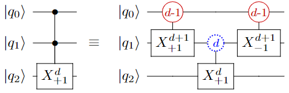

# quDiet
[](https://github.com/LegacYFTw/QuDiet/actions/workflows/python-app.yml)

A high performance simulator that scales and eats qudits for lunch.

# Installation
A simple pip install from the github repository will install the package in your system.

## Install with pip
```bash
$ pip install git+https://github.com/LegacYFTw/QuDiet

```
## Install wrom source
```bash
$ git clone https://github.com/LegacYFTw/QuDiet && cd QuDiet
$ pip3 install .
```

# Examples
Here are some simple examples.

We start by importing the package:
```python
from qudiet.core.quantum_circuit import QuantumCircuit
```

The class `QuantumCircuit` is the main interface representing the abstraction over the complicated calculations.

## A 3-Qudit Example

Let's start with this 3-qudit example, where $|q_0\rangle$ is a qubit whereas $|q_1\rangle$ and $|q_2\rangle$ are qutrits.




First, we start with initializing a blank circuit with the class `QuantumCircuit`. 

```python
qc = QuantumCircuit(

    # Represents the dimension of each quantum register
    qregs=[2, 3, 3],


    # Represents the initial states
    init_states=[0, 0, 0],
)
```

At a glance, the class `qudiet.core.quantum_circuit.QuantumCircuit` looks quite similar to Qiskit's `QuantumCircuit` class, with an exception of the `qregs` defining the qubit dimension of the registers. 

Now that we have a blank circuit, we can place quantum gates like this, 

```python
# Places the CX gate with control qudit q0, q1 and target qudit q2
qc.cx([0, 1], 2)

# The measure_all definition represents the end of the definition of a QuantumCircuit 
qc.measure_all()
```

Now that we are done with the definition of our QuantumCircui, we can execute the circuit with the `.run()` definition.

```python
qc.run()
```

## Backends

QuDiet comes with 4 different kinds of backend.

```python
# The NumPy Backend is the default Backend
from qudiet.core.backend.NumpyBackend import NumpyBackend

# Sparse Backend works great when there are no H gates
from qudiet.core.backend.SparseBackend import SparseBackend

# Experimental - GPU

# CUDA Backend is the GPU equivalent of the NumPy Backend
from qudiet.core.backend.CUDABackend import CUDABackend

# CUDA Sparse Backend is the GPU equivalent of the Sparse Backend
from qudiet.core.backend.CUDASparseBackend import CUDASparseBackend
```

These Backends can be declared when initializing the circuit with the class `qudiet.core.quantum_circuit.QuantumCircuit` using the argument`backend=NumpyBackend`.
```python
qc = QuantumCircuit(
    qregs=[2, 3, 3],
    init_states=[0, 0, 0],

    # Here goes the backend specification
    backend=NumpyBackend,
)
```


## Run from QASM

A typical qasm looks like  
```qasm
# This is the File Header
# The File Header section is compulsory

# Defining a 3 Qudit circuit
.qubit 3
qudit x0 (2)
qudit x1 (3)
qudit x2 (3)

# The Gate composition will go in this
# section, between the .begin and the .end
.begin

# Your Gates Here ...
Toffoli x0, x1, x2

.end
```

To run a circuit from qasm, we need to import a few definitions,

```python
from qudiet.qasm.qasm_parser import circuit_from_qasm, parse_qasm
```

The `circuit_from_qasm` definition creates the circuit from the qasm `str`. Whereas, the `parse_qasm` definition creates the circuit directly from the qasm file definition.

```python
# Loading the circuit from the qasm string
circuit = circuit_from_qasm(
    '''
    # This is the File Header
    
    .qubit 3
    qudit x0 (2)
    qudit x1 (3)
    qudit x2 (3)

    .begin
    Toffoli x0, x1, x2
    .end
    '''
)

# Now we can run the circuit however we want.
circuit.run()
```

The `parse_qasm` definition can be used as such.
```python
# Loading the circuit from a qasm file
filename = "test.qasm"
circuit = parse_qasm(filename, SparseBackend)

# Now we can run the circuit however we want.
result = circuit.run()
```

